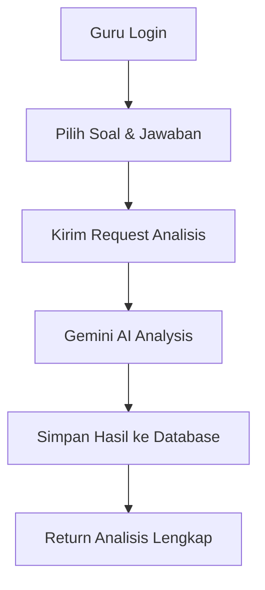
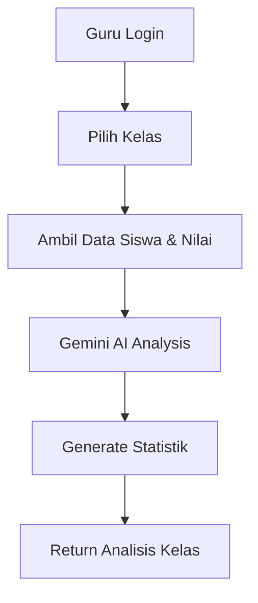
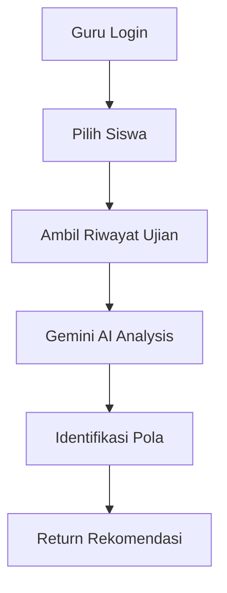

# 📚 Panduan Analisis Pedagogik - School Management System

## 🎯 Overview
Fitur analisis pedagogik menggunakan Gemini 2.0 Flash untuk memberikan analisis mendalam tentang hasil belajar siswa, performa kelas, dan pola pembelajaran.

## ✨ Fitur Utama

### 1. **Analisis Jawaban Siswa Individual**
- Analisis kemampuan kognitif siswa
- Identifikasi jenis dan penyebab kesalahan
- Rekomendasi pembelajaran personal
- Analisis pedagogik mendalam
- Strategi remedial yang tepat

### 2. **Analisis Performa Kelas**
- Distribusi nilai kelas
- Kekuatan dan kelemahan kelas
- Trend pembelajaran
- Rekomendasi pembelajaran diferensiasi
- Rencana pengembangan kelas

### 3. **Analisis Pola Pembelajaran Siswa**
- Trend perkembangan siswa
- Konsistensi pembelajaran
- Area perbaikan
- Potensi pengembangan
- Strategi pembelajaran individu

### 4. **Analisis Hasil Ujian**
- Analisis komprehensif hasil ujian
- Statistik peserta
- Rekomendasi perbaikan
- Evaluasi formatif

## 🔧 Setup dan Konfigurasi

### 1. **Install Dependencies**
```bash
pip install google-generativeai==0.3.2
```

### 2. **Setup Environment Variables**
Buat file `.env` dan tambahkan:
```env
GEMINI_API_KEY=your_gemini_api_key_here
```

### 3. **Get Gemini API Key**
1. Kunjungi [Google AI Studio](https://makersuite.google.com/app/apikey)
2. Buat API key baru
3. Copy dan paste ke file `.env`

## 📋 API Endpoints

### **1. Status Service**
```http
GET /api/pedagogic/status
```
**Response:**
```json
{
    "available": true,
    "model": "gemini-2.0-flash-exp",
    "message": "Pedagogic analysis service is ready"
}
```

### **2. Analisis Jawaban Siswa**
```http
POST /api/pedagogic/analyze-answer
Authorization: Bearer <teacher_token>
Content-Type: application/json

{
    "soal_id": 1,
    "jawaban_siswa_id": 1
}
```

**Response:**
```json
{
    "status": "success",
    "analisis_pedagogik": {
        "analisis_kognitif": {
            "tingkat_pemahaman": "Siswa menunjukkan pemahaman dasar...",
            "kemampuan_aplikasi": "Kemampuan aplikasi masih terbatas...",
            "kemampuan_analisis": "Kemampuan analisis perlu ditingkatkan...",
            "kesimpulan_kognitif": "Siswa berada pada tahap pemahaman dasar..."
        },
        "analisis_kesalahan": {
            "jenis_kesalahan": "Kesalahan konseptual",
            "penyebab_kesalahan": "Kurangnya pemahaman mendalam...",
            "pola_kesalahan": "Kesalahan berulang pada operasi serupa...",
            "kesimpulan_kesalahan": "Perlu pendekatan pembelajaran yang berbeda..."
        },
        "rekomendasi_pembelajaran": {
            "strategi_pembelajaran": "Gunakan pendekatan visual dan konkret...",
            "materi_penguatan": "Fokus pada konsep dasar operasi...",
            "metode_remedial": "Pembelajaran individual dengan scaffolding...",
            "alat_bantu": "Gunakan manipulatif dan visual aids..."
        },
        "analisis_pedagogik": {
            "aspek_pedagogik": "Pendekatan pembelajaran perlu disesuaikan...",
            "pendekatan_pembelajaran": "Gunakan metode discovery learning...",
            "evaluasi_formatif": "Lakukan evaluasi berkelanjutan...",
            "kesimpulan_pedagogik": "Perlu intervensi pedagogik yang tepat..."
        },
        "strategi_remedial": {
            "jenis_remedial": "Pembelajaran remedial individual",
            "durasi_remedial": "2-3 minggu dengan evaluasi berkala",
            "metode_evaluasi": "Evaluasi formatif dan sumatif",
            "target_pencapaian": "Peningkatan 20% dalam pemahaman konsep"
        },
        "ringkasan_analisis": "Ringkasan lengkap analisis pedagogik..."
    },
    "model_used": "gemini-2.0-flash-exp",
    "timestamp": "2024-01-15T10:30:00"
}
```

### **3. Analisis Performa Kelas**
```http
GET /api/pedagogic/analyze-class/{kelas_id}
Authorization: Bearer <teacher_token>
```

**Response:**
```json
{
    "status": "success",
    "analisis_kelas": {
        "analisis_performa_kelas": {
            "distribusi_nilai": "Kelas menunjukkan distribusi yang beragam...",
            "kekuatan_kelas": "Sebagian besar siswa memiliki motivasi tinggi...",
            "kelemahan_kelas": "Beberapa siswa mengalami kesulitan...",
            "trend_pembelajaran": "Trend pembelajaran menunjukkan peningkatan..."
        },
        "rekomendasi_pembelajaran_kelas": {
            "strategi_umum": "Gunakan pembelajaran diferensiasi...",
            "pembelajaran_diferensiasi": "Kelompokkan siswa berdasarkan kemampuan...",
            "pengelompokan_siswa": "Buat kelompok heterogen dan homogen...",
            "evaluasi_kelas": "Lakukan evaluasi berkelanjutan..."
        },
        "analisis_pedagogik_kelas": {
            "pendekatan_pembelajaran": "Gunakan pendekatan student-centered...",
            "metode_evaluasi": "Evaluasi multi-aspek...",
            "intervensi_pedagogik": "Intervensi yang tepat untuk setiap kelompok...",
            "kesimpulan_kelas": "Kelas memerlukan pendekatan yang beragam..."
        },
        "rencana_pengembangan": {
            "target_peningkatkan": "Peningkatan rata-rata nilai 15%",
            "strategi_intervensi": "Program remedial dan enrichment...",
            "timeline": "3 bulan dengan evaluasi bulanan",
            "indikator_keberhasilan": "Peningkatan nilai dan motivasi belajar"
        }
    },
    "statistik_kelas": {
        "total_siswa": 30,
        "nilai_tinggi": 8,
        "nilai_menengah": 15,
        "nilai_rendah": 7,
        "persentase_tinggi": 26.67,
        "persentase_menengah": 50.0,
        "persentase_rendah": 23.33
    },
    "model_used": "gemini-2.0-flash-exp",
    "timestamp": "2024-01-15T10:30:00"
}
```

### **4. Analisis Pola Pembelajaran Siswa**
```http
GET /api/pedagogic/analyze-student/{siswa_no}
Authorization: Bearer <teacher_token>
```

**Response:**
```json
{
    "status": "success",
    "analisis_pola": {
        "analisis_pola_pembelajaran": {
            "trend_perkembangan": "Siswa menunjukkan trend positif...",
            "konsistensi_pembelajaran": "Konsistensi pembelajaran cukup baik...",
            "area_perbaikan": "Perlu perbaikan pada pemahaman konsep...",
            "potensi_pengembangan": "Siswa memiliki potensi tinggi..."
        },
        "rekomendasi_pembelajaran_individu": {
            "strategi_personal": "Gunakan pendekatan yang sesuai gaya belajar...",
            "metode_pembelajaran": "Kombinasikan visual, auditori, dan kinestetik...",
            "alat_bantu": "Gunakan teknologi dan manipulatif...",
            "evaluasi_berkelanjutan": "Lakukan evaluasi formatif..."
        },
        "analisis_pedagogik_individu": {
            "gaya_belajar": "Siswa cenderung visual-kinestetik...",
            "motivasi_pembelajaran": "Motivasi intrinsik cukup tinggi...",
            "hambatan_pembelajaran": "Kesulitan dalam pemahaman abstrak...",
            "kesimpulan_individu": "Perlu pendekatan yang lebih konkret..."
        }
    },
    "model_used": "gemini-2.0-flash-exp",
    "timestamp": "2024-01-15T10:30:00"
}
```

### **5. Analisis Hasil Ujian**
```http
GET /api/pedagogic/analyze-exam/{exam_id}
Authorization: Bearer <teacher_token>
```

**Response:**
```json
{
    "status": "success",
    "analisis_kelas": {
        // Same structure as class analysis
    },
    "exam_info": {
        "exam_id": 1,
        "nama_ujian": "Ujian Tengah Semester Matematika",
        "kelas": 1,
        "pelaksanaan": "2024-01-15",
        "status": "completed",
        "total_participants": 30
    },
    "model_used": "gemini-2.0-flash-exp",
    "timestamp": "2024-01-15T10:30:00"
}
```

## 🧪 Testing

### **Manual Testing dengan Postman**

1. **Import Collection**
   - Import file Postman collection yang sudah diupdate
   - Set variable `base_url` = `http://localhost:5000`

2. **Login dan Set Token**
   ```bash
   POST {{base_url}}/api/teacher/login
   {
       "email": "guru@sekolah.com",
       "password": "password123"
   }
   ```

3. **Test Endpoints**
   - Test semua endpoint di section "Pedagogic Analysis"
   - Verifikasi response dan error handling

### **Automated Testing**
```bash
python test_pedagogic_analysis.py
```

## 🔐 Keamanan dan Validasi

### **Role-Based Access Control**
- Semua endpoint memerlukan role 'guru'
- Decorator `@teacher_required` untuk validasi
- Session-based authentication

### **Error Handling**
- Proper error messages untuk setiap validasi
- Graceful handling jika Gemini API tidak tersedia
- Database constraint handling

### **Data Validation**
- Validasi ID soal dan jawaban siswa
- Validasi kelas dan siswa exists
- Validasi ujian exists

## 📊 Workflow Analisis

### **1. Analisis Jawaban Siswa**


### **2. Analisis Performa Kelas**


### **3. Analisis Pola Pembelajaran**


## 🎯 Aspek Analisis Pedagogik

### **1. Analisis Kognitif**
- **Tingkat Pemahaman**: Evaluasi pemahaman konsep
- **Kemampuan Aplikasi**: Kemampuan menerapkan konsep
- **Kemampuan Analisis**: Kemampuan menganalisis masalah
- **Kesimpulan Kognitif**: Ringkasan kemampuan kognitif

### **2. Analisis Kesalahan**
- **Jenis Kesalahan**: Kategorisasi kesalahan
- **Penyebab Kesalahan**: Identifikasi root cause
- **Pola Kesalahan**: Pattern kesalahan berulang
- **Kesimpulan Kesalahan**: Analisis mendalam kesalahan

### **3. Rekomendasi Pembelajaran**
- **Strategi Pembelajaran**: Pendekatan yang tepat
- **Materi Penguatan**: Konten yang perlu diperkuat
- **Metode Remedial**: Strategi perbaikan
- **Alat Bantu**: Media dan tools pembelajaran

### **4. Analisis Pedagogik**
- **Aspek Pedagogik**: Evaluasi aspek pembelajaran
- **Pendekatan Pembelajaran**: Metode yang sesuai
- **Evaluasi Formatif**: Strategi evaluasi
- **Kesimpulan Pedagogik**: Ringkasan pedagogik

### **5. Strategi Remedial**
- **Jenis Remedial**: Tipe intervensi
- **Durasi Remedial**: Timeline perbaikan
- **Metode Evaluasi**: Cara evaluasi
- **Target Pencapaian**: Sasaran yang diharapkan

## 🛠️ Troubleshooting

### **Error Umum:**

1. **"Pedagogic analysis not available"**
   - Install package: `pip install google-generativeai==0.3.2`
   - Set environment variable `GEMINI_API_KEY`

2. **"Access denied. Teacher role required"**
   - Pastikan user memiliki role 'guru'
   - Periksa token authentication

3. **"Soal not found" / "Jawaban siswa not found"**
   - Pastikan ID soal dan jawaban valid
   - Periksa data di database

4. **"Gemini API Error"**
   - Periksa API key valid
   - Periksa koneksi internet
   - Periksa quota API

## 📈 Monitoring dan Analytics

### **Metrics yang Dimonitor:**
- Jumlah analisis yang dilakukan
- Waktu response Gemini API
- Akurasi analisis
- User satisfaction

### **Logs dan Debugging:**
- API request/response logs
- Error logs
- Performance metrics
- User activity logs

## 🚀 Deployment

### **Requirements:**
- Python 3.8+
- Google Generative AI package
- Valid Gemini API key
- Database dengan kolom json_result

### **Environment Variables:**
```env
GEMINI_API_KEY=your_gemini_api_key_here
DB_HOST=localhost
DB_USER=root
DB_PASSWORD=your_password
DB_NAME=school_db
```

### **Setup Commands:**
```bash
# Install dependencies
pip install -r requirements.txt

# Set environment variables
export GEMINI_API_KEY=your_key_here

# Run application
python app.py

# Test functionality
python test_pedagogic_analysis.py
```

## 📝 Best Practices

### **1. API Usage**
- Monitor API quota dan limits
- Implement rate limiting jika diperlukan
- Cache hasil analisis untuk efisiensi

### **2. Data Privacy**
- Jangan kirim data sensitif ke API
- Anonymize data jika diperlukan
- Implement data retention policies

### **3. Performance**
- Implement caching untuk hasil analisis
- Optimize database queries
- Monitor response times

### **4. User Experience**
- Provide loading indicators
- Show meaningful error messages
- Implement progressive disclosure

## 🎉 Kesimpulan

Fitur analisis pedagogik menggunakan Gemini 2.0 Flash memberikan:
- ✅ Analisis mendalam kemampuan siswa
- ✅ Rekomendasi pembelajaran yang tepat
- ✅ Evaluasi pedagogik komprehensif
- ✅ Strategi remedial yang efektif
- ✅ Monitoring performa kelas
- ✅ Analisis pola pembelajaran

Sistem siap memberikan insights pedagogik yang berharga untuk meningkatkan kualitas pembelajaran! 